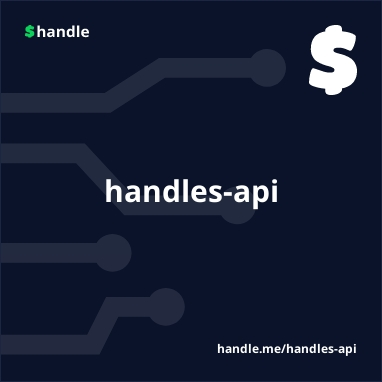

# Decentralized Public API for Handles

<p align="center">
  
</p>

Our Decentralized API uses Ogmios to scan a cardano-node for Handles related transactions. The information is stored in a custom, in-memory index for quick reads. We take a snapshot of the index once a day. This snapshot is loaded each time the container starts to decrease load times.

&nbsp;

# Getting Started

### Prerequisites
- Install Docker - https://docs.docker.com/get-docker/


### Run the following:
```sh
docker pull koralabs/handles-api
docker run -p 3141:3141 -v db:/db -v handles:/app/handles koralabs/handles-api
```
- The `-v db:/db` and the `-v handles:/handles` in the command above can be omitted, but we recommeded it so the `cardano-node` db and handle scan progress is saved to the host when the container goes down.
- You can also map a volume to the node socket with `-v <path_to_socket_folder>:/ipc`. This lets you use the cardano-node with other apps outside the container.

&nbsp;

### If you already have a cardano-node running, you can use the ogmios-only version: 
```sh
docker pull koralabs/handles-api
docker run -p 3141:3141 -v <path_to_node.socket_folder>:/ipc -v handles:/app/handles -e MODE=ogmios koralabs/handles-api:latest
```

- Replace `<path_to_socket_folder>` with the path to your ipc folder on the host that has the node.socket file

&nbsp;

# Testing the API 
- Open a browser to [http://localhost:3141/swagger](http://localhost:3141/swagger)
- You can also see the current API status at [http://localhost:3141/health](http://localhost:3141/health)
- **🚩WARNING:** All endpoints will return a <span style="color:red">202</span> when it is running but the scan hasn't reached the tip of the chain yet. It is not recommended to use the results until a <span style="color:green">200</span> status is returned.

&nbsp;

## TESTNET ENVIRONMENTS
To use Preview or PreProd environments just add `-e NETWORK=preview` or `-e NETWORK=preprod` to either of the `docker run...` commands.

&nbsp;

## OTHER OPTIONS
All of the options below can be passed into the container using `-e ENV_VAR=value` arguments on the `docker run...` command.
> `MODE=<api-only|ogmios|cardano-node|both|all>`
`api-only` will skip cardano-node and Ogmios and will only run the API NodeJS Express app. This requires `OGMIOS_HOST` to be set.
`ogmios` will run only Ogmios 
`cardano-node` will run only cardano-node
`both` will wun both cardano-node and Ogmios
`all` DEFAULT - This runs cardano-node, ogmios, and the API

> `OGMIOS_HOST=<http url with port>` Required for running with `MODE=api-only`.

> `DISABLE_NODE_SNAPSHOT=true` By default, the container will try and download a cardano-node snapshot with Mithril to reduce spin-up time. Use this option to skip the snapshot download and start cardano-node from origin. **🚩WARNING:** this can take a few days.

> `DISABLE_HANDLES_SNAPSHOT=true` By default, the container will try and download a Handles snapshot from S3 to reduce spin-up time. Use this option to skip the snapshot download and start the Ogmios Handles scan from origin. **🚩WARNING:** this can take a few hours.

&nbsp;

## NOTES

Depending on your internet connectino, it can take a 45 minutes to a few hours to download the cardano-node snapshot and begin an Ogmios scan.

A minimum of 24GB of RAM is required when running the container - 32GB recommended. If running in Ogmios-only mode, 4GB minimum is required, 8GB recommended.

The containers are setup for graceful cardano-node shutdown, but if you have to shut it down manually, for a more graceful shutdown (which helps subsequent load times), try running on the host (or in the container):
```sh
kill -SIGINT $(pidof cardano-node) 
```